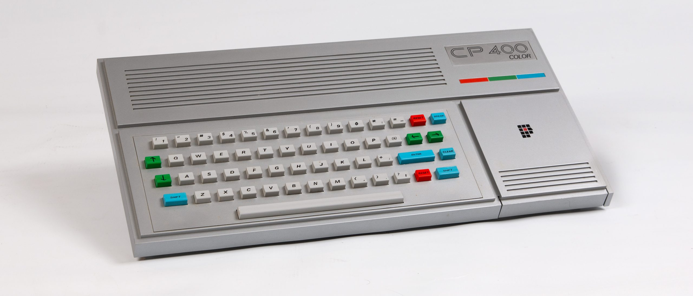

# The Retro Hacker Clone Series

<p align="center">
	
</p>

The Retro Hacker Clone Series is an open hardware and software project to recreate and emulate classic Brazilian computers from the 1980s using modern ESP32-S3 based hardware.

This repository is the host project for the series. It brings together the shared hardware work, firmware projects, local KiCad libraries, documentation, and supporting assets used to build ESP32-based recreations of multiple machines from Brazil's 8-bit home computer era.

The first computers planned for emulation in this series are:

- Prologica CP400
- MSX1
- MSX2

The first implementation target is the Prologica CP400, a Brazilian TRS-80 Color Computer 2 compatible home computer. The CP400 work builds on the earlier ESP32 CP400 project and keeps the same practical goal: make a usable, hackable CP400-inspired machine with real connectors, keyboard and joystick paths, VGA output, SD-backed storage, and firmware that can run a CoCo 2 / CP400 style environment on inexpensive contemporary hardware.

## Project Vision

The goal is not to build museum props. The goal is to create practical, buildable modern recreations that preserve the character, software culture, and hardware feel of Brazilian 1980s computers while making them approachable for today's builders.

Each clone in the series is expected to combine two sides of the work:

- Hardware designs that give each emulator a dedicated physical form.
- Firmware that recreates the original computer environment on ESP32-based hardware.

The project is designed for retrocomputing enthusiasts, hardware hackers, firmware developers, and anyone interested in studying and preserving Brazil's microcomputer history through working machines.

## First Target: Prologica CP400

The Prologica CP400 was one of the memorable Brazilian home computers of the mid-1980s. Built during Brazil's market-reserve era, it was compatible with the Tandy/Radio Shack TRS-80 Color Computer 2, known as the CoCo 2, but arrived with its own Brazilian industrial design, PAL-M video expectations, local peripherals, translated software, and a particular place in the local 8-bit scene.

Under the hood, the original CP400 family followed the CoCo architecture closely:

- Motorola MC6809E CPU running around 0.895 MHz
- Motorola MC6847 video display generator
- 16 KB or 64 KB RAM configurations
- Extended Color BASIC in ROM
- Cassette, cartridge, joystick, serial, video, and expansion interfaces
- Optional disk support through the CP450 floppy system

The CP400 emulator firmware currently explores the CoCo 2 / CP400 environment on ESP32-S3 hardware, including video output, input handling, SD storage, virtual disk support, and emulator menu infrastructure.

## Upcoming Targets: MSX1 and MSX2

After the CP400, the first planned expansion targets are MSX1 and MSX2 machines. The MSX line became hugely important in Brazil and represents another major branch of the country's 1980s home computer culture.

The MSX1 and MSX2 projects are intended to reuse the broader clone-series structure while allowing each machine to keep its own hardware assumptions, firmware requirements, video behavior, input model, storage conventions, and software ecosystem.

## Repository Layout

```text
hardware/esp32_clones/          KiCad project for the shared ESP32 clone hardware
hardware/esp32_clones/libraries Project-local KiCad symbols and footprints
software/esp32_cp400_emulator/  PlatformIO firmware for the CP400 emulator
software/esp32_msx1_emulator/   Work area for the MSX1 emulator
software/esp32_msx2_emulator/   Work area for the MSX2 emulator
images/                         Project images and documentation assets
```

## Hardware

The KiCad project lives in `hardware/esp32_clones` and is named `esp32_clones`.

The local KiCad libraries are organized inside:

```text
hardware/esp32_clones/libraries/symbols
hardware/esp32_clones/libraries/footprints
```

The hardware design includes project-local footprints and symbols for the ESP32-S3 module, USB connectors, SD card socket, switches, and other board-level parts. The intent is to give the firmware a board that feels more like a small computer than a loose development kit on a bench.

## Firmware

The first firmware project lives in `software/esp32_cp400_emulator` and is built with PlatformIO using the Arduino framework for ESP32-S3.

Current CP400 software areas include:

- MC6809 emulator core integration
- CoCo 2 / CP400 video mode handling
- VGA output through the ESP32-S3 VGA library
- USB soft-host input support
- SD/MMC storage access
- Virtual floppy disk image handling
- Emulator menu and firmware updater code
- Joystick and keyboard mapping hooks

The PlatformIO environment is configured for an ESP32-S3 DevKitC-style board with 16 MB flash and 8 MB PSRAM.

## ROMs and Original Software

Original CP400, CoCo, MSX, BASIC, cartridge, cassette, and floppy software may still be copyrighted. This repository is for original hardware, firmware, and project files. Bring your own legally obtained ROMs and software images when needed.

## Historical Notes

The CP400 was part of a wider Brazilian TRS-Color ecosystem that included machines such as the Codimex CD-6809, LZ Color 64, Dynacom MX-1600, and Varix VC50. The MSX line later became one of the most important home computer families in Brazil, with a large software, game, education, and hobbyist culture.

The Retro Hacker Clone Series exists at the meeting point of those histories: Brazilian microcomputer design, international 8-bit architectures, local software preservation, and the practical charm of machines that can be built, modified, and used today.

## References and Further Reading

- [Prologica CP-400](https://en.wikipedia.org/wiki/Prol%C3%B3gica_CP-400)
- [CP400](https://pt.wikipedia.org/wiki/CP400)
- [TRS-80 Color Computer](https://en.wikipedia.org/wiki/TRS-80_Color_Computer)
- [MSX](https://en.wikipedia.org/wiki/MSX)
- [Prologica](https://pt.wikipedia.org/wiki/Prol%C3%B3gica)
- [Datassette](https://datassette.org/) for Brazilian retrocomputing manuals, magazines, books, and software preservation material

## License

See `LICENSE.txt` for the repository license. Some firmware or third-party library directories may include their own license files; check those before reusing or redistributing project materials.
