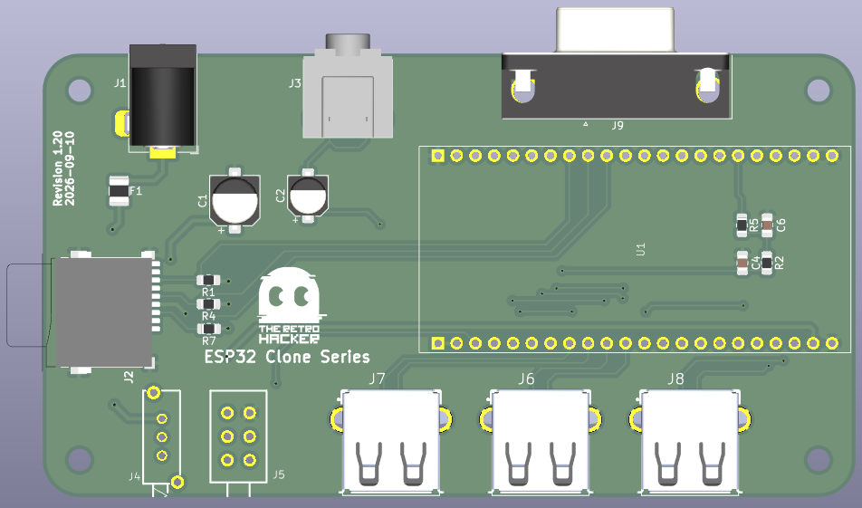
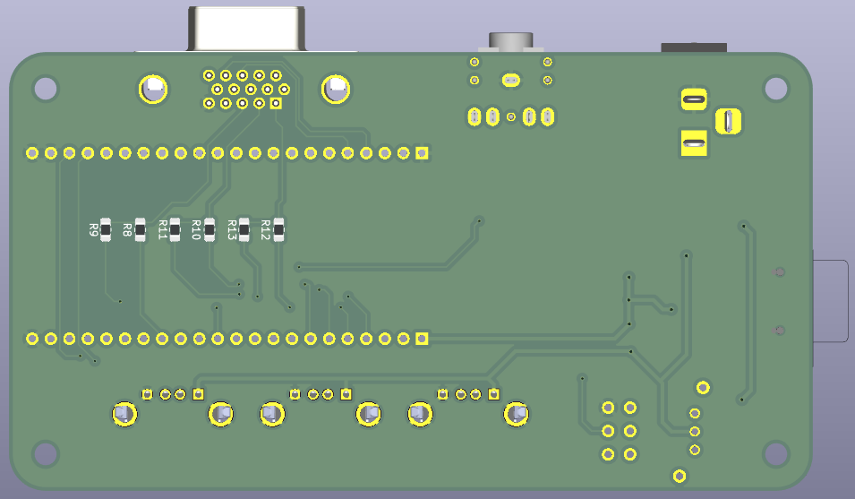

# The Retro Hacker Clone Series

The Retro Hacker Clone Series brings together hardware designs and source-available firmware to recreate and emulate classic Brazilian computers from the 80s using modern ESP32-S3 based hardware.

 The board is designed to feel like a small retro computer rather than a bare dev board, and the firmwares are built to be practical, tweakable, and easy to build from a standard Git checkout.

At the moment the series includes two emulator builds on the same ESP32-S3 board:

| Firmware | Covered machines | Project |
| --- | --- | --- |
| CP400 | Prologica CP400 / CoCo 2 | [Firmware](software/esp32_cp400_emulator/) and [change log](software/esp32_cp400_emulator/docs/log.md) |
| MSX | MSX1, MSX2, and MSX2+ | [Setup guide](software/esp32_msx_emulator/README.md) and [change log](software/esp32_msx_emulator/docs/log.md) |

Both builds share the same board, VGA output, USB keyboard input, SD-card storage, and a simple F12 menu for setup and firmware updates.

## Why this exists

The goal is not to produce a display piece. This is meant to be a useful, buildable retro-computing emulation based platform: something that captures the character of a Brazilian 80s machine without needing a pile of original hardware on the bench.

The project sits between hardware design, emulator work, and preservation. It keeps the board layout, software, and documentation together in one place so someone can build, test, and modify it without digging through a dozen disconnected repos.

## CP400

The Prologica CP400 was one of the more recognizable Brazilian home computers of the 1980s. It was compatible with the Tandy/Radio Shack TRS-80 Color Computer 2, but it had its own industrial design, Brazilian-language software ecosystem, and local hardware expectations.

The [CP400 firmware](software/esp32_cp400_emulator/) recreates that environment on ESP32-S3 hardware, including MC6809 emulation, VGA output, native USB keyboard support, joystick inputs, SD storage, virtual floppy handling, and the F12 configuration/update menu.

## MSX

The MSX has a very special place in Brazilian computing history. It officially arrived in Brazil in 1985 through two locally produced machines: the HotBit, from Sharp/Epcom, and the Expert, from Gradiente. At a time when Brazil’s computer market was heavily restricted and imported machines were difficult and expensive to obtain, the MSX became one of the country’s most important home-computing platforms. Its standardized architecture, large software library, expandability, and built-in BASIC introduced an entire generation not only to games, but also to programming, electronics, and computer technology. 

The [MSX firmware](software/esp32_msx_emulator/README.md) runs the original fMSX core on the same shared board. It includes multiple BIOS profiles for Omega MSX2+, Gradiente Expert 1.1, Sharp Hotbit 1.2, and Panasonic FS-A1WSX / FS-A1F / FS-A1FX.

This is a practical build: bring your own legally obtained ROMs and BIOS files, load them from SD, and boot from the menu. The software supports the core MSX experience with USB keyboard input, graphics, sound, cartridge booting, and firmware updates through the on-screen menu. and... USB joystick support, of course.

The F12 Media menu attaches writable `.dsk` images to drives A/B and read-only
`.cas` tapes, with ejection, tape rewind and optional saved boot defaults.
Disk access requires a compatible user-supplied disk BIOS; see the
[disk and tape setup guide](software/esp32_msx_emulator/README.md#disk-and-tape-images).

## Repository layout

```text
hardware/esp32_clones/          KiCad PCB and shared board files
hardware/esp32_clones/libraries Local KiCad symbols and footprints
hardware/esp32_clones/bom       Interactive BOM and BOM assets
software/esp32_cp400_emulator/  PlatformIO firmware for the CP400 build
software/esp32_msx_emulator/    MSX firmware and setup files
images/                         Generated images and project documentation assets
```

## Board renderings

The PCB below is the current KiCad board layout for the shared ESP32 clone board. The front and back views are generated directly from the project PCB.

<div align="center">
  
  
</div>

For the full component-by-component assembly view, open the [interactive BOM](https://htmlpreview.github.io/?https://raw.githubusercontent.com/cristianoag/esp32_clones/blob/main/hardware/esp32_clones/bom/ibom.html).


## Hardware summary

The board is built around an ESP32-S3 DevKitC-style N16R8 module with 16 MB flash and 8 MB OPI PSRAM. It includes VGA output, a USB keyboard port, SD/MMC storage, a mono audio output, and a compact layout intended to behave more like a small computer than a bare dev board.

The shared board is used by both firmware projects, and the pin mapping is documented in the [MSX hardware section](software/esp32_msx_emulator/README.md#hardware).

## BOM and purchasing

This is the current BOM for the board as defined in the KiCad project. The table is meant to be a quick parts reference for ordering and build prep.

| Component | Description | Qty | Package | AliExpress |
| --- | --- | ---: | --- | --- |
| C1 | 220 µF electrolytic capacitor | 1 | 6.3x3 mm | [AliExpress](https://s.click.aliexpress.com/e/_c3vZZzuN) |
| C2 | 10 µF electrolytic capacitor | 1 | 5x4.5 mm | [AliExpress](https://s.click.aliexpress.com/e/_c3vZZzuN) |
| C4 | 100 nF ceramic capacitor | 1 | 0805 | [AliExpress](https://s.click.aliexpress.com/e/_c31gzw17) |
| C6 | 47 nF ceramic capacitor | 1 | 0805 | [AliExpress](https://s.click.aliexpress.com/e/_c31gzw17) |
| F1 | Resettable fuse / polyfuse | 1 | 1210 | [AliExpress](https://s.click.aliexpress.com/e/_c36cHi81) |
| J1 | DC barrel jack | 1 | Horizontal | [AliExpress](https://s.click.aliexpress.com/e/_c3D102dx) |
| J2 | Micro SD card socket | 1 | uSD | [AliExpress](https://s.click.aliexpress.com/e/_c3odXI41) |
| J3 | 3.5 mm audio jack | 1 | PJ-307 | [AliExpress](https://s.click.aliexpress.com/e/_c4DX94lF) |
| J4 | 12V power header / connector | 1 | PS-12E05 | [AliExpress](https://s.click.aliexpress.com/e/_c42cnGRn) |
| J5 | 5V power header / connector | 1 | PS-22F05 | [AliExpress](https://s.click.aliexpress.com/e/_c35YnsCh) |
| J6–J8 | USB-A connector | 3 | TE 6364372-2 | [AliExpress](https://s.click.aliexpress.com/e/_c4afTAHb) |
| J9 | DB15 video connector | 1 | D-sub 15-pin | [AliExpress](https://s.click.aliexpress.com/e/_c3K7eRWv) |
| R1, R4, R7 | 10 kΩ resistor | 3 | 0805 | [AliExpress](https://s.click.aliexpress.com/e/_c2zrvGiH) |
| R8, R10, R12 | 1.2 kΩ resistor | 3 | 0805 | [AliExpress](https://s.click.aliexpress.com/e/_c2zrvGiH) |
| R9, R11, R13 | 560 Ω resistor | 3 | 0805 | [AliExpress](https://s.click.aliexpress.com/e/_c2zrvGiH) |
| R2, R5 | 330 Ω resistor | 2 | 0805 | [AliExpress](https://s.click.aliexpress.com/e/_c2zrvGiH) |
| U1 | ESP32-S3-WROOM-1 module | 1 | ESP32-S3-WROOM-1 | [AliExpress](https://s.click.aliexpress.com/e/_c2uppnEv) |

## Firmware build notes

Both firmware projects use PlatformIO with the Arduino framework and a pinned `espressif32@6.11.0` platform. From the project directory you want to use, run:

```powershell
Set-Location .\software\esp32_cp400_emulator
# or:
# Set-Location .\software\esp32_msx_emulator

make firmware
```

The build produces FLH packages for each target; the project directories keep their own firmware images and configuration.
Each firmware directory includes its own board definitions and required
library sources and can be copied and compiled independently of the other.
Both still require PlatformIO and the configured ESP32 toolchain.

## ROMs and original software

Original CP400, CoCo, MSX, BASIC, cartridge, cassette, and floppy software may still be copyrighted. This repository is for original hardware, firmware, and project files. Use legally obtained ROMs and software images when needed.

## Historical notes

The CP400 was part of the wider Brazilian TRS-Color ecosystem, and the MSX line later became one of the most important home computer families in Brazil. This project sits at the intersection of those histories: a practical board, a pair of emulator builds, and a small bit of preservation work for machines that still matter to a lot of people.

## References

- [Prologica CP-400](https://en.wikipedia.org/wiki/Prol%C3%B3gica_CP-400)
- [CP400](https://pt.wikipedia.org/wiki/CP400)
- [TRS-80 Color Computer](https://en.wikipedia.org/wiki/TRS-80_Color_Computer)
- [MSX](https://en.wikipedia.org/wiki/MSX)
- [fMSX by Marat Fayzullin](https://fms.komkon.org/fMSX/)
- [Prologica](https://pt.wikipedia.org/wiki/Prol%C3%B3gica)
- [Datassette](https://datassette.org/)

## License


All hardware and firmware binaries in this repository are released under the Creative Commons Attribution-NonCommercial-ShareAlike 4.0 International license. Personal builds and community tinkering are encouraged, but commercial use or resale requires explicit authorization from the author.
